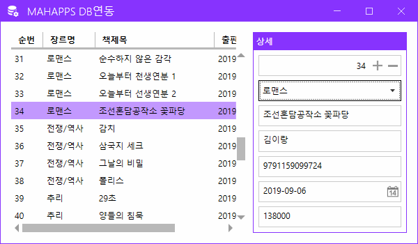
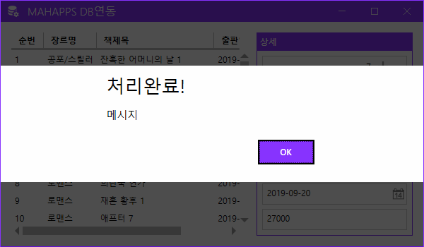
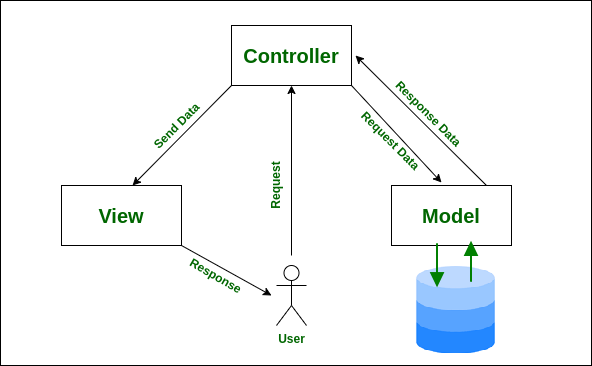
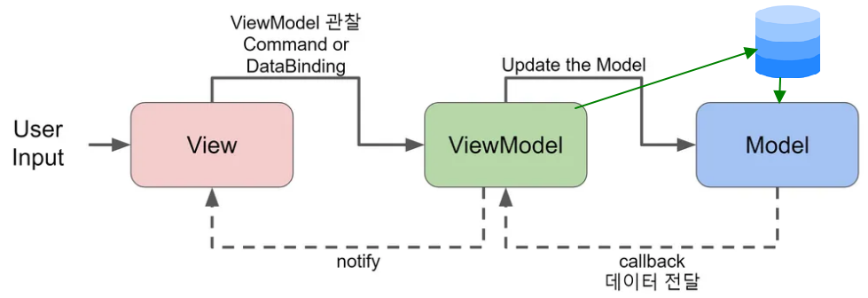

# IoT_WPF_2025
WPF Study

## 1일차
- Windows Presentation Foundation
    - 미흡한 WinForms 디자인, 속도 개선, `개발과 디자인 분리` 개선을 위해 만들어진 MS 프레임워크
    - 화면디자인을 XML 기반의 xaml

### WPF DB 바인딩
1. 프로젝트 생성 - [디자인](./day01/Day01Wpf/WpfBasicApp01/MainWindow.xaml), [소스](./day01/Day01Wpf/WpfBasicApp01/MainWindow.xaml.cs)
2. NuGet 패키지에서 `MahApps.Metro(디자인)` 라이브러리 설치
3. 디자인 영역
    - App.xaml
    - MainWindow.xaml
    - MainWindow.xaml.cs의 기반클래스를 변경하는 것 - 디자인
4. UI구현
5. DB연결 사전준비
    - NuGet 패키지에서 `MySQL.Data` 라이브러리 설치
6. DB 연결
    1. DB 연결 문자열(ConnectionString) : DB 종류마다 연결 문자열 포맷 다름. 무조건 있어야 함
    2. 쿼리 : 실행할 쿼리(보통 SELECT, INSERT, UPDATE, DELETE)
    3. 데이터 담을 객체 : 리스트 형식
    4. DB 연결 객체(`SqlConnection`) : 연결 문자열 처리하는 객체. DB연결, 연결 해제, 연결 확인...
        - DB 종류별로 MySqlConnection, SqlConnection, OracleConnection...
    5. DB 명령 객체(`SqlCommand`) : 쿼리 컨트롤하는 객체
        - ExecuteReader() : SELECT문 실행, 결과 데이터를 담는 메서드
        - ExecuteScalar() : SELECT문 중 count() 등 함수로 1개의 데이터만 1row/1column 데이터만 가져오는 메서드 
        - ExecuteNonQuery() : INSERT, UPDATE, DELETE문과 같이 transaction이 발생하는 쿼리 실행에 사용하는 메서드
    6. 데이터어댑터(`SqlDataAdapter`) : DB 연결 이후 데이터 처리를 쉽게 도와주는 인터페이스 객체
        - DB 명령 객체처럼 쿼리를 직접 실행할 필요 없음
        - DataTable, DataSet 객체에 Fill() 메서드로 자동으로  채워줌
        - 거의 SELECT문에만 사용
    7. DB 데이터리더(`SqlDataReader`)
        - DataReader : ExecuteReader()로 가져온 데이터 조작하는 객체

7. 실행 결과

    

8. MahApps.Metro 방식 다이얼로그 처리

    

9. 여기까지 개발한 방식은` 전통적인 C# 윈앱 개발`과 차이 없음

### WPF MVVM
- [디자인 패턴](https://ko.wikipedia.org/wiki/%EC%86%8C%ED%94%84%ED%8A%B8%EC%9B%A8%EC%96%B4_%EB%94%94%EC%9E%90%EC%9D%B8_%ED%8C%A8%ED%84%B4)
- [참고](https://refactoring.guru/ko/design-patterns/classification)
    - 소프트웨어 공학에서 공통적으로 발생하는 문제를 재사용 가능하게 해결한 방식들
    - 반복적으로 되풀이되는 개발디자인의 문제를 해결하도록 맞춤화시킨 양식(템플릿)
    - 여러 디자인패턴 중 아키텍쳐패턴, 그 중 디자인과 개발을 분리해 개발할 수 있는 패턴 준비
        - MV* : MVC, MVP, MVVM...

- **MVC** : Model-View-Controller 패턴
    - 사용자 인터페이스(View)와 비즈니스 로직(Controller, Model)을 분리해서 앱 개발
    - 디자이너에게 최소한의 개발에 참여시킴
    - 개발자는 디자인 고려하지 않고 개발만 할 수 있음
    - 사용자는 Controller에게 요청
    - Controller가 Model에게 데이터 요청
    - Model이 DB에서 데이터 가져와 Controller로 전달
    - Controller는 데이터를 비즈니스로직에 따라서 처리하고 View로 전달
    - View는 데이터를 화면에 뿌려주고, 화면상에서 처리할 것을 모두 마친 후 사용자에게 응답

    - 구조는 복잡, 각 부분별 개발코드는 간결
    - Spring, ASP.NET, django 등 웹개발 아키텍처패턴 표준으로 사용

    

- MVP : Model-View-Presenter 패턴
    - MVC 패턴에서 파생됨
    - Presenter : Supervising Controller라고 부름

- **MVVM** - Model-View-ViewModel
    - MVC 패턴에서 파생됨
    - 마크업언어로 GUI 코드 구현하는 아키텍처
    - 사용자는 View로 접근(MVC와 차이점)
    - ViewModel이 Controller 역할(비즈니스로직 처리)
    - Model은 DB요청, 응답
    - 연결방식이 MVC와 다름
    - 전통적인 C# 방식은 사용자가 이벤트 발생시키기 때문에 발생 시기를 바로 알 수 있음
    - MVVM 방식은 C#이 변화를 주시하고 있어야 함. 상태가 바뀌면 변화를 줘야 함

    

### WPF MVVM 연습
1. 프로젝트 생성 - [디자인](./day01/Day01Wpf/WpfBasicApp02/View/MainWindow.xaml), [소스](./day01/Day01Wpf/WpfBasicApp02/ViewModel/MainViewModel.cs)
2. WPF DB 바인딩 연습 시 사용한 UI 그대로 복사
3. Model, View, ViewModel 폴더 생성
4. MainWindow.xaml을 View로 이동
5. App.xaml StartupUri 수정
6. Model 폴더 내 Book 클래스 생성
    - INotifyPropertyChanged 인터페이스 : 객체 내의 어떤 속성값이 변경되면 상태를 C#에게 알려주는 기능
    - PropertyChangedEventHandler 이벤트 생성
7. ViewModel 폴더 내 MainViewModel 클래스 생성

## 2일차

## 3일차

## 4일차

## 5일차

## 6일차
