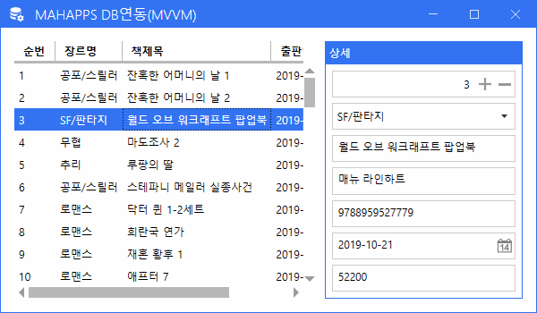
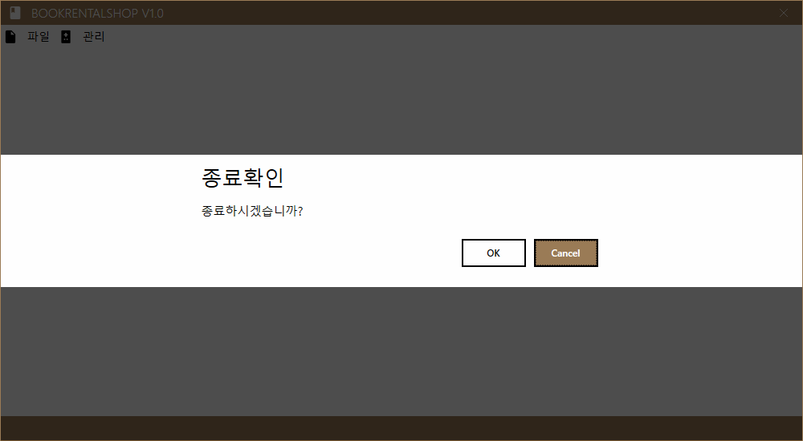
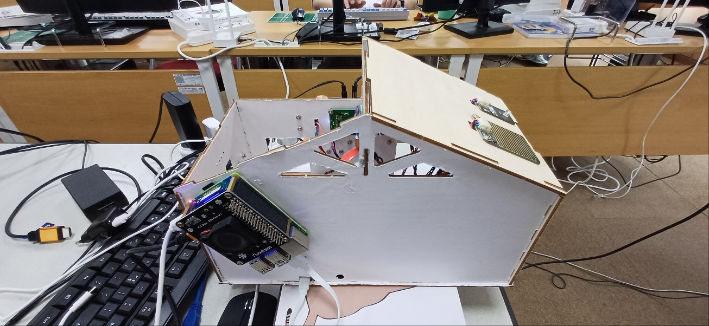

# IoT_WPF_2025
WPF Study

## 1일차
- Windows Presentation Foundation
    - 미흡한 WinForms 디자인, 속도 개선, `개발과 디자인 분리` 개선을 위해 만들어진 MS 프레임워크
    - 화면디자인을 XML 기반의 xaml

### WPF DB 바인딩
1. 프로젝트 생성 - [디자인](./day01/Day01Wpf/WpfBasicApp01/MainWindow.xaml), [소스](./day01/Day01Wpf/WpfBasicApp01/MainWindow.xaml.cs)
2. NuGet 패키지에서 `MahApps.Metro(디자인)` 라이브러리 설치
3. 디자인 영역
    - App.xaml
    - MainWindow.xaml
    - MainWindow.xaml.cs의 기반클래스를 변경하는 것 - 디자인
4. UI구현
5. DB연결 사전준비
    - NuGet 패키지에서 `MySQL.Data` 라이브러리 설치
6. DB 연결
    1. DB 연결 문자열(ConnectionString) : DB 종류마다 연결 문자열 포맷 다름. 무조건 있어야 함
    2. 쿼리 : 실행할 쿼리(보통 SELECT, INSERT, UPDATE, DELETE)
    3. 데이터 담을 객체 : 리스트 형식
    4. DB 연결 객체(`SqlConnection`) : 연결 문자열 처리하는 객체. DB연결, 연결 해제, 연결 확인...
        - DB 종류별로 MySqlConnection, SqlConnection, OracleConnection...
    5. DB 명령 객체(`SqlCommand`) : 쿼리 컨트롤하는 객체
        - ExecuteReader() : SELECT문 실행, 결과 데이터를 담는 메서드
        - ExecuteScalar() : SELECT문 중 count() 등 함수로 1개의 데이터만 1row/1column 데이터만 가져오는 메서드 
        - ExecuteNonQuery() : INSERT, UPDATE, DELETE문과 같이 transaction이 발생하는 쿼리 실행에 사용하는 메서드
    6. 데이터어댑터(`SqlDataAdapter`) : DB 연결 이후 데이터 처리를 쉽게 도와주는 인터페이스 객체
        - DB 명령 객체처럼 쿼리를 직접 실행할 필요 없음
        - DataTable, DataSet 객체에 Fill() 메서드로 자동으로  채워줌
        - 거의 SELECT문에만 사용
    7. DB 데이터리더(`SqlDataReader`)
        - DataReader : ExecuteReader()로 가져온 데이터 조작하는 객체

7. 실행 결과

    

8. MahApps.Metro 방식 다이얼로그 처리

    

9. 여기까지 개발한 방식은` 전통적인 C# 윈앱 개발`과 차이 없음

### WPF MVVM
- [디자인 패턴](https://ko.wikipedia.org/wiki/%EC%86%8C%ED%94%84%ED%8A%B8%EC%9B%A8%EC%96%B4_%EB%94%94%EC%9E%90%EC%9D%B8_%ED%8C%A8%ED%84%B4)
- [참고](https://refactoring.guru/ko/design-patterns/classification)
    - 소프트웨어 공학에서 공통적으로 발생하는 문제를 재사용 가능하게 해결한 방식들
    - 반복적으로 되풀이되는 개발디자인의 문제를 해결하도록 맞춤화시킨 양식(템플릿)
    - 여러 디자인패턴 중 아키텍쳐패턴, 그 중 디자인과 개발을 분리해 개발할 수 있는 패턴 준비
        - MV* : MVC, MVP, MVVM...

- **MVC** : Model-View-Controller 패턴
    - 사용자 인터페이스(View)와 비즈니스 로직(Controller, Model)을 분리해서 앱 개발
    - 디자이너에게 최소한의 개발에 참여시킴
    - 개발자는 디자인 고려하지 않고 개발만 할 수 있음
    - 사용자는 Controller에게 요청
    - Controller가 Model에게 데이터 요청
    - Model이 DB에서 데이터 가져와 Controller로 전달
    - Controller는 데이터를 비즈니스로직에 따라서 처리하고 View로 전달
    - View는 데이터를 화면에 뿌려주고, 화면상에서 처리할 것을 모두 마친 후 사용자에게 응답

    - 구조는 복잡, 각 부분별 개발코드는 간결
    - Spring, ASP.NET, django 등 웹개발 아키텍처패턴 표준으로 사용

    

- MVP : Model-View-Presenter 패턴
    - MVC 패턴에서 파생됨
    - Presenter : Supervising Controller라고 부름

- **MVVM** - Model-View-ViewModel
    - MVC 패턴에서 파생됨
    - 마크업언어로 GUI 코드 구현하는 아키텍처
    - 사용자는 View로 접근(MVC와 차이점)
    - ViewModel이 Controller 역할(비즈니스로직 처리)
    - Model은 DB요청, 응답
    - 연결방식이 MVC와 다름
    - 전통적인 C# 방식은 사용자가 이벤트 발생시키기 때문에 발생 시기를 바로 알 수 있음
    - MVVM 방식은 C#이 변화를 주시하고 있어야 함. 상태가 바뀌면 변화를 줘야 함

    

### WPF MVVM 연습
1. 프로젝트 생성 - [디자인](./day01/Day01Wpf/WpfBasicApp02/View/MainWindow.xaml), [소스](./day01/Day01Wpf/WpfBasicApp02/ViewModel/MainViewModel.cs)
2. WPF DB 바인딩 연습 시 사용한 UI 그대로 복사
3. Model, View, ViewModel 폴더 생성
4. MainWindow.xaml을 View로 이동
5. App.xaml StartupUri 수정
6. Model 폴더 내 Book 클래스 생성
    - INotifyPropertyChanged 인터페이스 : 객체 내의 어떤 속성값이 변경되면 상태를 C#에게 알려주는 기능
    - PropertyChangedEventHandler 이벤트 생성
7. ViewModel 폴더 내 MainViewModel 클래스 생성
    - INotifyPropertyChanged 인터페이스 구현
    - OnPropertyChanged 이벤트핸들러 메서드 구현
8. MainView.xaml에 ViewModel 연결

    ```xml
        xmlns:vm="clr-namespace:WpfBasicApp02.ViewModel"
        DataContext="{DynamicResource MainVM}"
        ...   
    <mah:MetroWindow.Resources>
        <!-- MainViewModel을 가져와서 사용하겠다!! -->
        <vm:MainViewModel x:Key="MainVM" />
    </mah:MetroWindow.Resources>
    ```
9. MainView.xaml 컨트롤에 바인딩 작업
    - 전통적인 C# 방식 : x:Name 사용(비하인드 사용 필요), 마우스이벤트 추가
    
    ```xml
    <!-- UI 컨트롤 구성 -->
    <DataGrid x:Name="GrdBooks" 
            Grid.Row="0" Grid.Column="0" Margin="5" 
            AutoGenerateColumns="False" IsReadOnly="True" 
            MouseDoubleClick="GrdBooks_MouseDoubleClick">
    <DataGrid.Columns>
    <DataGridTextColumn Binding="{Binding Idx}" Header="순번" />
    ```

    - WPF MVVM 바인딩 방식 : 전부 Binding 사용

    ```xml
    <!-- UI 컨트롤 구성 -->
    <DataGrid Grid.Row="0" Grid.Column="0" Margin="5" 
            AutoGenerateColumns="False" IsReadOnly="True"
            ItemsSource="{Binding Books}"
            SelectedItem="{Binding SelectedBook, Mode=TwoWay}">
    <DataGrid.Columns>
    <DataGridTextColumn Binding="{Binding Idx}" Header="순번" />
    ```

10. 실행 결과

    

- MVVM 장단점
    - View <-> ViewModel간 데이터 자동 연동
    - 로직 분리로 구조가 명확
    - 팀프로젝트 개발 시 역할 분담이 확실
    - 테스트, 유지보수 쉬움
    - 구조가 복잡. 디버깅 어려움
    - 스케일이 커짐


## 2일차

### MVVM Framework
- MVVM 개발 자체가 어려움. 초기 개발 시 MVVM 템플릿 만드는데 시간 많이 소요됨
- 조금 쉽게 개발하고자 3rd party에서 개발한 MVVM 프레임워크 사용
- 종류
    - `Prism` : MS계열에서 직접 개발. 대규모 앱 개발시 사용. 모듈화 잘 되어있음. 커뮤니티 활발
        - 진입장벽 높음
    - `Caliburn.Micro` : 경량화된 프레임워크. 쉽게 개발할 수 있음. Xaml 바인딩 생략 가능. 커뮤니티 감소 추세
        - [공식사이트](https://caliburnmicro.com/)
        - [GitHub](https://github.com/Caliburn-Micro/Caliburn.Micro)
        - MahApps.Metro에서 사용 중
        - 디버깅 어려움
        - [문제]MahApps.Metro의 메시지박스 다이얼로그 구현이 안 됨
    - `MVVM Light Toolkit` : 가장 가벼운 MVVM 입문용. 쉬운 Command 지원. 개발 종료
        - 확장성이 떨어짐
    - **`CommunityToolkit.Mvvm`** : MS 공식 경량 MVVM. 단순, 빠름. 커뮤니티 활발
        - NotifyPropertyChanged 사용할 필요 없음
        - 모듈 기능이 없음
    - `ReactiveUI` : Rx기반 MVVM. 비동기, 스트림처리 강력. 커뮤니티 활발
        - 최신 기술
        - 진입장벽 높음

### Caliburn.Micro 학습
1. WPF 프로젝트 생성
2. NuGet 패키지 Caliburn.Micro 검색 후 설치
3. App.xaml의 StartupUri 삭제 - [소스](./day02/Day02Wpf/WpfBasicApp01/App.xaml)
4. Models, Views, ViewModels(이름 똑같아야 함) 폴더 생성
5. MainViewModel 클래스 생성 - [소스](./day02/Day02Wpf/WpfBasicApp01/ViewModels/MainViewModel.cs)
    - MainView에 속하는 ViewModel은 반드시 **`MainViewModel`** 이라는 이름 써야함
6. MainWindow.xaml을 View로 이동
7. MainWindow를 MainView로 이름 변경
8. Bootstrapper 클래스 생성, 작성 - [소스](./day02/Day02Wpf/WpfBasicApp01/Bootstrapper.cs)
9. App.xaml에서 Resource 추가
10. MahApps.Metro UI 적용

    

### Caliburn.Micro MVVM 연습
1. WPF 프로젝트 생성 - [소스](./day02/Day02Wpf/WpfBasicApp02/ViewModels/MainViewModel.cs)
2. 필요 라이브러리 설치
    - MySQL.Data
    - MahApps.Metro
    - MahApps.Metro.IconPacks
    - Caliburn.Micro
3. Models, Views, ViewModels로 폴더 생성
4. 이전 작업 소스코드 복사, 네임스페이스 변경

    

## 3일차

### CommunityToolkit.Mvvm
1. WPF 프로젝트 생성
2. 필요 라이브러리 설치
    - CommunityToolkit.Mvvm
    - MahApps.Metro
    - MahApps.Metro.IconPacks
3. Models, Views, ViewModels 폴더 생성
4. MainWindow.xaml 삭제
5. App.xaml StartupUrl 삭제
6. Views/MainView.xaml 생성
7. ViewModels/MainViewModel.cs 생성
8. App.xaml Startup 이벤트 추가
    - App.xaml.cs 로직 추가
9. App.xaml MahApps.Metro 관련 리소스 추가
10. MainView MetroWindow로 변경

    

### Log 라이브러리
- 개발한 앱, 솔루션의 현재상태를 계속 모니터링하는 기능
- Log 사용법
    - 직접 코딩 방식
    - 로그 라이브러리 사용 방식
- Log 라이브러리
    - NLog : 가볍고 쉬움. 빠름. 데스크탑 개발 시 사용
    - Serilog : 어려움. 빠름. 웹개발 시 사용
    - Log4net : Java의 로그를 .NET으로 이전. 느림. 웹개발 시 사용
    - ZLogger : 제일 최신(2021). 초고속. 게임서버 개발 시 사용

### NLog 라이브러리 사용
1. NuGet 패키지 > NLog, NLog.Schema 설치
2. 새 항목 >  XML 파일 > NLog.config 생성
3. Info < Debug < Warn < Error < Fatal
4. NLog.config를 출력 디렉토리로 복사
5. Debug, Trace는 출력이 안 됨
6. Info, Warn, Error, Fatal 사용 권장

    

### DB연결 CRUD 연습
1. WPF 프로젝트 생성
2. NuGet 패키지 필요 라이브러리 설치
    - CommunityToolkit.Mvvm
    - MahApps.Metro / MahApps.Metro.IconPacks
    - MySql.Data
    - NLog
3. Model, Views, ViewModels 폴더 생성
4. App.xaml 초기화 작업
5. MainView.xaml, MainViewModel 메인화면 MVVM 작업
    - 메뉴 작업
    - ContentControl 추가
6. 하위 사용자컨트롤 작업
    - BookGenre(View, ViewModel)
    - Books(View, ViewModel)
7. Models > Genre(DivisionTbl) 모델 작업
8. BookGenreViewModel DB처리

    https://github.com/user-attachments/assets/85c36757-55f1-42b2-8e41-ea97f3f61947

## 4일차
1. BookGenre에서 INSERT, UPDATE 구현
2. NLog.config 생성
3. Helpers.Common 클래스 생성
    - NLog 인스턴스 생성
    - 공통 DB 연결 문자열 생성
    - MahApps.Metro 다이얼로그 코디네이터 생성
4. 각 ViewModel에 IDialogCoordinator 관련 코드 추가
    - ViewModel 생성자에 파라미터 추가
    - View, ViewModel 연동 시 IDialogCoordinator 연결
5. View에 Dialog 관련 네임스페이스, 속성 추가
6. await this.dialogCoordinator.ShowMessageAsync() 사용

    

7. BookView.xaml 화면 작업
8. MemberView.xaml, RentalView.xaml 화면 작업
9. ViewModel들 작업

    

#### DB연결 CRUD 연습 시 추가 필요 사항
- [O] 여러 번 나오는 로직 메서드화
- [O] NLog로 각 기능 동작 시 로그 남기기. 공통화 작업
- [O] 연결문자열 Common으로 이전
- [O] 종료 메뉴 다이얼로그 MetroUI로 변경
- [O] MahApps.Metro 메시지 형태로 변경
- [O] 삭제여부 메시지박스 추가

### DB연결 CRUD 실습
- BooksView, BooksViewModel 작업 실습

## 5일차
### MovieFinder 2025
- 전체 UI : UI설계화면 다섯영역으로 구분

    

- 영화즐겨찾기앱
    - TMDB 사이트에서 제공하는 OpenAPI로 데이터 가져오기
    - 내가 좋아하는 영화리스트 선택, 즐겨찾기 저장
    - 저장한 영화만 리스트업, 삭제 가능
    - 선택된 영화 더블클릭 > 영화 상세정보 팝업
    - 선택된 영화 선택 > 예고편보기 > 유튜브동영상 팝업

- API / OpenAPI
    - Applicaiton Programming Interface
    - 개발자가 직접개발하지 않고 제3자가 만들어서 제공하는 서비스

- TMDB, Youtube
    - [TMDB](https://www.themoviedb.org/) API 신청
    - [Youtube Data API](https://console.cloud.google.com/) 신청    
        - 프로젝트 생성 후 API 및 서비스 > 라이브러리
        - Youtube Data API v3 선택
        - 사용버튼 클릭 
        - 사용자 인증정보 입력

### 프로젝트 시작
1. WPF 프로젝트 생성
2. NuGet 패키지 사용할 기본 라이브러리 설치
    - CommunityToolkit.Mvvm
    - MahApps.Metro / MahApps.Metro.IconPacks
    - MySql.Data
    - NLog
3. 폴더생성 : Helpers, Models, Views, ViewModels
4. MVVM 구조 초기작업
5. UI 구현

    

6. 로직구현
    1. TMDB API 사용 구현
    2. 관련 기능 전부구현
7. 데이터그리드 더블클릭해서 상세정보 표시
    - NuGet 패키지에서 Microsoft.Xaml.Behaviors.Wpf 설치
8. 텍스트박스에서 엔터시 이벤트 발생 처리
9. 텍스트박스 한글 입력 우선 처리
10. 실행시 텍스트박스에 포커스 가도록 처리

    https://github.com/user-attachments/assets/9afd19ee-2d43-4b72-b12b-6c2406c7127f

## 6일차

### 2025-MOVIE FINDER
1. 상태표시줄 시계 동작
2. 상태표시줄 검색 결과 건수 표시
3. 로그 출력 정리
4. 즐겨찾기 DB연동
    1. MySQL Workbench에서 moviefinder 데이터베이스(스키마 생성)
    2. movieitems 테이블 생성. 컬럼은 MovieItem.cs 속성과 동일
    3. INSERT, UPDATE, DELETE 작업

    

5. YouTube 예고편 보기
    1. TrailerView, TrailerViewModel 생성
    2. WPF 기본 WebBrowser는 HTML5 기술이 표현 안 됨. 오류 많음
    3. NuGet 패키지 - CefSharp WebBrowser 패키지 설치
    4. **CefSharp.Wpf.NET Core 설치 시 프로젝트 속성 > 일반 > 빌드 > 플랫폼 대상 > Any CPU에서 x64로 변경**
    5. NuGet 패키지 - Google.Apis.YouTube.v3 설치

6. 기타 작업 완료
7. 결과 화면

    https://github.com/user-attachments/assets/895dd8c0-e57e-42eb-a64b-8e1577a03033

## 7일차
### 부산광역시 부산맛집 정보앱
1. [데이터포털](https://www.data.go.kr/) Open API
2. WPF 프로젝트 생성
3. NuGet 패키지 라이브러리 설치
    - CommunityToolkit.Mvvm
    - MahApps.Metro / MahApps.Metro.IconPacks
    - Newtonsoft.JSON
    - CefSharp.Wpf.NETCore (플랫폼 X64)
    - NLog
4. MVVM 초기화
5. UI 디자인 및 구현

## 8일차

### 부산광역시 부산맛집 정보앱
1. 그리드 표현 아이템 조정
2. 메인창 내용 구글맵 창으로 이동
3. cefSharp.Wpf로 구글맵 지도 표현
4. 위도(Latitude), 경도(Longitude) 표현

    https://github.com/user-attachments/assets/47a2b9c6-2e17-47be-bd1c-a5a8652f78f1

### 스마트홈 연동 모니터링앱
- 전면부

- 후면부


- [개발링크](https://github.com/hugoMGSung/hungout-with-arduino/tree/main/SmartHomeDIY)

1. Arduino + Raspberry Pi 스마트홈 기제작

#### MQTT


- Message Queueing Telemetry Transport : 기계간 통신용 경량 메시징 프로토콜
- Publish / Subscribe
    - Publish(발행) : 메시지를 만들어서 전달
    - Subscribe(구독) : 필요한 메시지를 수신받아서 사용
- Server(MQTT 브로커)/Client 프로그램으로 동작
- 데이터는 휘발성 : 받는 사람이 없으면 데이터 사라짐. DB에 저장하는 구성을 해줘야 함

- MQTT를 대체할 수 있는 유사한 기능을 하는 기술
    - `Redis`, `Apache Kafka`, RabbitMQ, ZeroMQ, Socket 통신 직접 개발

#### MQTT 시뮬레이션 프로젝트
1. MQTT 브로커 설치
    - https://mosquitto.org/download/
    - mosquitto-2.0.21a-install-windows-x64.exe 설치
    - 설치 후 서비스에서 실행 중지
2. Mosquitto 설정파일 수정
    - mosquitto.conf 문서에디터 관리자 모드로 오픈
    - 235번째 줄 #listner -> listener 1883 으로 변경
    - 534번째 줄 #allow_anonymous false -> #allow_anonymous true 로 변경
3. 파일 저장 후 서비스 재시작
4. Windows 보안
    - 방화벽 및 네트워크 보호 > 고급 설정
    - 인바운드 규칙 > 새 규칙
    - 포트 선택 > 다음
    - TCP 선택, 특정포트 1883 입력
5. MQTT Explorer 설치
    - new Connection 생성, Host 127.0.0.1, Port 1883 저장
    - CONNECT
6. VSCode에서 MqttPub.py 파일 생성 [MqttPub.py](./day08/Pythons/MqttPub.py)

### 스마트홈 프로젝트 시작
1. 화면 UI 변경
2. NuGet 패키지
    - CommunityToolkit.Mvvm 설치
3. Models, Views, ViewModels 폴더 생성
4. MainWindow 바인딩 처리
5. MainViewModel에서 바인딩 속성 초기화

    


   https://github.com/user-attachments/assets/2ee98652-2b88-40eb-b95f-4344ed16d7f9


## 9일차

### 스마트홈 연동 모니터링앱

#### 네트워크 확인
- telnet 명령어로 서버 서비스가 동작중인지 확인

```shell
> telnet 아이피주소 포트번호
# MySQL 접속 가능 여부
> telnet 127.0.0.1 3306
# MQTT 접속 가능 여부
> telnet 127.0.0.1 1883
```

#### MQTT 시뮬레이션
1. MqttPub.py 소스코드에 Fake IoT 센서값 전달 코드 작성
2. Fake 센싱값을 json으로 Publish
3. C# MahApps.Metro 사용 MQTT 데이터 Subscriber 앱
    - CommunityToolkit.Mvvm
    - MahApps.Metro
    - MahApps.Metro.IconPacks
    - Newtonsoft.Json
    - MQTTnet
    - MySql.Data

4. DB서버에 접속자 정보확인 쿼리
    ```sql
    SELECT * FROM information_schema.processlist LIMIT 10; -- 데이터가 10건 이상이면 LIMIT 10은 삭제
    ```

5. WPF MVVM 전체구현
6. MqttPub.py와 Publish된 IoT데이터 WPF에서 Subscribe 예제

https://github.com/user-attachments/assets/ac36dd5b-48d9-4910-9d76-4fd10d751727

## 10일차

### 스마트홈 연동 모니터링앱

#### 스마트홈 기기 실제 IoT센서 데이터 모니터링 앱
- SmartHome MQTT JSON Key값
    - L : Light 전등
    - R : Rain(Water Drop Sensor)
    - T : Temperature 온도
    - H : Humidity 습도
    - F : Fan 선풍기/에어컨
    - V : Human Detection 침입 감지
    - RL : Real Light 실제 전등 켜짐 여부
    - CB : ChaimBell 벨 푸쉬 여부

- 실행화면 생략(9일차 화면과 동일)

#### 스마트홈 WPF 실시간 시각화
- NuGet 패키지
    - MQTTnet
    - Newtonsoft.Json
    - NLog
- WpfMqttSubApp.Models의 SensingInfo.cs 가져오기
- MQTT 센서 데이터로 동작 변수 값 할당
- 실행 화면

    스마트홈 조작영상

    https://github.com/user-attachments/assets/cd0c2b52-4132-49e5-b906-512dd72dd5eb


    스마트홈 모니터링앱 동작 영상
    
    https://github.com/user-attachments/assets/371d158b-6686-4947-8b21-cce305324d23
